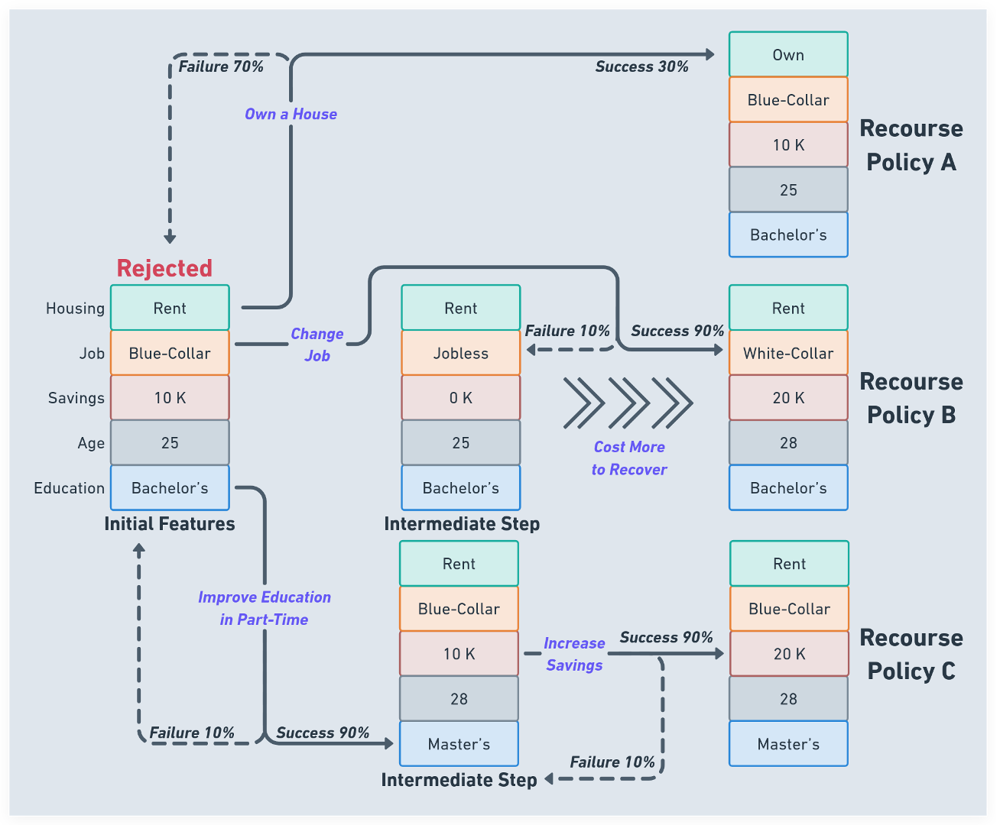

<!-- MARKDOWN LINKS & IMAGES -->
<!-- https://www.markdownguide.org/basic-syntax/#reference-style-links -->

<!-- ABOUT THE PROJECT -->
# SafeAR: Towards Safer Algorithmic Recourse by Risk-Aware Policies

To provide *risk-aware* recommendations to people who are unfavorably treated by a machine learning model

[Haochen Wu](https://haochenw.info), [Shubham Sharma](https://www.linkedin.com/in/shubham-sharma-8271b312a),  [Sunandita Patra](https://www.linkedin.com/in/sunandita-patra-84b16b35/), [Sriram Gopalakrishnan](https://www.linkedin.com/in/sriram-gopalakrishnan-7a07b727/)

**Publication**: [XAI-FIN-2023 workshop](https://sites.google.com/view/2023-workshop-explainable-ai/accepted-papers?authuser=0) (Co-located with [ICAIF '23](https://ai-finance.org/))  |
[Preprint version](https://arxiv.org/abs/2308.12367)

